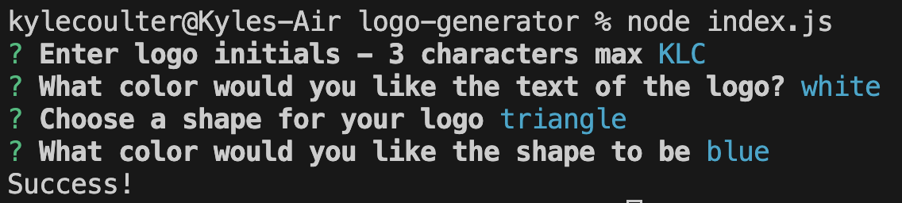
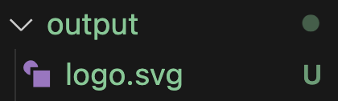
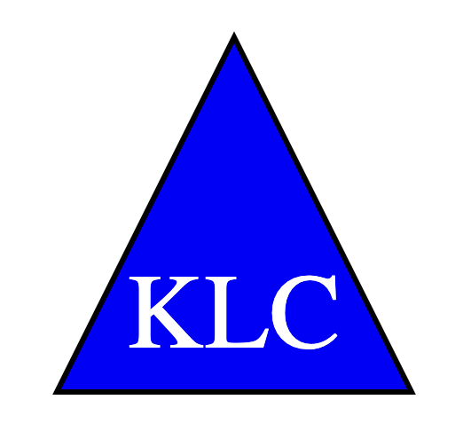

# Logo Generator

## Description

This app was designed to make simple logos for your company or projects.

Custom designed logos can be expensive and unnecessary for most applications. This app cuts out the middle-man and allows you to create a simple SVG logo that will represent your company or project.

By completeing this project I was able to expand on skills I have learned in the coding bootcamp.

I learned that product design can be a very rewarding subject and that backend testing is vital to app deployment.

## Table of Contents

- [Installation](#Installation)
- [Useage](#Useage)
- [Credits](#Credits)
- [License](#License)
- [Contribute](#Contribute)
- [Tests](#Tests)

## Installation

Make sure that all of the NPMs are stored locally in the file by running 'npm install". This will allow you to run the program. To run the program, run the command "node index.js".

## Useage

After calling the program, you will be presented with a series of questions relating to your design. 

Fill out the text section, text color section, choose a shape and the shape color and a new SVG file will be uploaded to the output folder.

## Credits

Thank you to my coding class instructors Roger and Sasha for the instruction that allowed me to produce this app.

## License

MIT License

## Contribute

See my contact information in the Questions section below. 

## Tests

## Questions

https://github.com/coulterkyle

For questions regarding this app, contact me at:

e-mail: kcoulter2002@gmail.com
